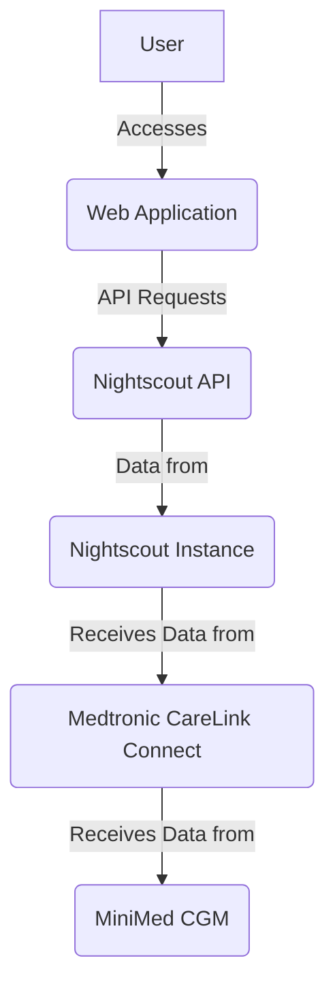

# Glucose Tracker for MiniMed CGM

This is a web application designed to track a person's glucose levels by connecting to a Nightscout instance, which in turn receives data from a MiniMed Continuous Glucose Monitor (CGM) via Medtronic CareLink Connect.

## Features

*   **Real-time Glucose Display:** Shows current glucose readings and trend.
*   **Historical Data Visualization:** Interactive line chart displaying glucose trends over 3, 6, 12, or 24 hours.
*   **Configurable Nightscout Connection:** Easily set up your Nightscout URL and API secret.
*   **Auto-Refresh:** Automatically updates glucose data every 5 minutes.
*   **Responsive Design:** Optimized for various screen sizes.

## Architecture

The application follows a client-server architecture:

*   **Frontend:** A React application for the user interface.
*   **Backend:** (Implicit) The Nightscout API serves as the data source, which the React app directly consumes.
*   **Data Source:** Nightscout instance, which integrates with Medtronic CareLink Connect to get data from the MiniMed CGM.



## Setup and Installation

To run this application locally, you will need Node.js (which includes npm and pnpm) installed on your system.

1.  **Clone the repository (or extract the project files):**

    ```bash
    git clone <repository-url>
    cd glucose-tracker
    ```

2.  **Install Dependencies:**

    ```bash
    pnpm install
    ```

3.  **Start the Development Server:**

    ```bash
    pnpm run dev
    ```

    The application will typically be available at `http://localhost:5173`.

## Configuration

Upon first launch, the application will present a configuration screen:

1.  **Nightscout URL:** Enter the base URL of your Nightscout instance (e.g., `https://your-nightscout.herokuapp.com`).
2.  **API Secret (Optional):** If your Nightscout instance requires authentication, enter your API secret.

Click "Connect to Nightscout" to save your configuration and proceed to the main dashboard.

## Usage

Once configured, the dashboard will display:

*   Your current glucose level with a trend indicator.
*   A graph of your glucose history. You can switch between 3, 6, 12, and 24-hour views.
*   A refresh button to manually fetch the latest data.
*   A settings button to reconfigure your Nightscout connection.

## Important Notes

*   This application relies on a **pre-existing and properly configured Nightscout instance** that is receiving data from your MiniMed CGM.
*   Direct integration with the MiniMed CGM device is not supported by this application due to the lack of public APIs from Medtronic.
*   Ensure your Nightscout URL is correct and accessible from where you are running the application.

## Technologies Used

*   **React:** Frontend JavaScript library
*   **Vite:** Fast frontend build tool
*   **Tailwind CSS:** Utility-first CSS framework
*   **shadcn/ui:** Reusable UI components
*   **Recharts:** Charting library for React
*   **Lucide React:** Icon library

## License

This project is open-source and available under the MIT License.
